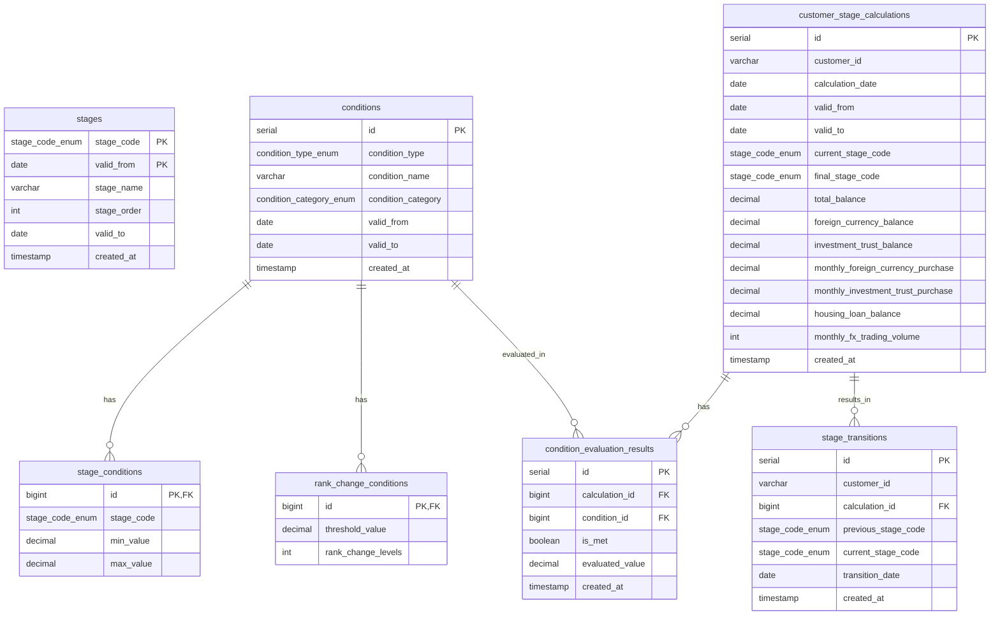

# 銀行口座ステージ月次バッチ処理設計書

## 1. 概要

本設計書は、銀行口座ステージの月次判定バッチ処理のデータベース設計および処理フローを定義します。このバッチ処理は、月末の残高や取引状況に基づいて顧客のステージを判定し、翌月の1ヶ月間適用される優遇特典を決定します。

## 2. 業務要件

### 2.1 ステージ区分

銀行口座のステージは以下の4つに分類されます：

- ステージなし
- シルバー
- ゴールド
- プラチナ

### 2.2 ステージ獲得条件

#### 2.2.1 シルバーステージ

シルバーステージは以下のいずれかの条件を満たせば獲得できます：

| 条件           | 基準値        |
|--------------|------------|
| 月末の総残高       | 合計300万円以上  |
| 外貨預金の積立購入    | 月間合計額3万円以上 |
| 投資信託 積み立てプラン | 月間合計額3万円以上 |

#### 2.2.2 ゴールド・プラチナステージ

ゴールドとプラチナステージは以下の2項目の合計金額によって決定されます：

- 月末の外貨預金残高（円換算額）
- 月末の投資信託残高（約定日基準）

| ステージ | 条件                 |
|------|--------------------|
| ゴールド | 合計500万円以上1,000万円未満 |
| プラチナ | 合計1,000万円以上        |

#### 2.2.3 ランクアップ条件

以下の条件によりステージをアップグレードすることが可能です：

- いずれか1つを満たすと1ランクアップ
- 2つとも満たすと2ランクアップ

| 追加条件          | 詳細                     |
|---------------|------------------------|
| 住宅ローン残高       | あればランクアップ              |
| 外国為替証拠金取引（FX） | 月間取引枚数1,000枚以上 でランクアップ |

### 2.3 ステージ処理サイクル

ステージは毎月月末に判定され、翌月1ヶ月間適用されます。

## 3. データベース設計

### 3.1 データベーステーブル構成

銀行口座ステージ判定システムは以下のテーブルで構成されます：

- **stages**: ステージの基本情報
- **conditions**: 条件の基本情報（親テーブル）
- **stage_conditions**: ステージ獲得条件
- **rank_change_conditions**: ランクアップ条件
- **customer_stage_calculations**: 顧客ステージ計算結果
- **condition_evaluation_results**: 条件評価結果
- **stage_transitions**: ステージ遷移履歴

### 3.2 テーブル詳細

#### 3.2.1 stages テーブル

```sql
CREATE TYPE stage_code_enum AS ENUM ('NONE', 'SILVER', 'GOLD', 'PLATINUM');

CREATE TABLE stages (
    stage_code stage_code_enum NOT NULL,
    stage_name VARCHAR(50) NOT NULL,                         -- Display name of the stage
    stage_order INT NOT NULL,                                -- Order for ranking stages (0 = lowest, ascending)
    valid_from DATE NOT NULL,                                -- Date from which this stage definition becomes valid
    valid_to DATE NOT NULL DEFAULT '9999-12-31',             -- Date until which this stage definition remains valid
    created_at TIMESTAMP NOT NULL DEFAULT CURRENT_TIMESTAMP, -- Record creation timestamp

    -- Primary Key
    PRIMARY KEY (stage_code, valid_from)
);
```

| カラム名        | データ型            | 説明                                          |
|-------------|-----------------|---------------------------------------------|
| stage_code  | stage_code_enum | ステージコード（NONE/SILVER/GOLD/PLATINUM）、複合主キーの一部 |
| stage_name  | VARCHAR(50)     | ステージの表示名                                    |
| stage_order | INT             | ステージの順位（0が最低、昇順）                            |
| valid_from  | DATE            | このステージ定義が有効になる日付、複合主キーの一部                   |
| valid_to    | DATE            | このステージ定義が有効である最終日                           |
| created_at  | TIMESTAMP       | レコード作成日時                                    |

#### 3.2.2 conditions テーブル

```sql
CREATE TYPE condition_type_enum AS ENUM ('TOTAL_BALANCE', 'FOREIGN_CURRENCY_PURCHASE', 'INVESTMENT_TRUST_PURCHASE', 'COMBINED_BALANCE_GOLD', 'COMBINED_BALANCE_PLATINUM', 'HOUSING_LOAN', 'FX_TRADING');
CREATE TYPE condition_category_enum AS ENUM ('STAGE', 'RANK_CHANGE');

CREATE TABLE conditions (
    id SERIAL PRIMARY KEY,                                   -- Auto-increment ID
    condition_type condition_type_enum NOT NULL,             -- Type of condition
    condition_name VARCHAR(100) NOT NULL,                    -- Display name of the condition
    condition_category condition_category_enum NOT NULL,     -- Category of condition
    valid_from DATE NOT NULL,                                -- Date from which this condition becomes valid
    valid_to DATE NOT NULL DEFAULT '9999-12-31',             -- Date until which this condition remains valid
    created_at TIMESTAMP NOT NULL DEFAULT CURRENT_TIMESTAMP, -- Record creation timestamp

    -- Ensure unique combination
    CONSTRAINT uq_condition_type_valid UNIQUE (condition_type, valid_from, valid_to)
);

```

| カラム名               | データ型                    | 説明                                                       |
|--------------------|-------------------------|----------------------------------------------------------|
| id                 | SERIAL                  | 主キー、自動増分（条件参照用）                                          |
| condition_type     | condition_type_enum     | 条件のタイプ（TOTAL_BALANCE, MONTHLY_PURCHASE, HOUSING_LOAN など） |
| condition_name     | VARCHAR(100)            | 条件の表示名                                                   |
| condition_category | condition_category_enum | 条件のカテゴリ（STAGE または RANK_CHANGE）                           |
| valid_from         | DATE                    | この条件が有効になる日付                                             |
| valid_to           | DATE                    | この条件が有効である最終日（デフォルト: 9999-12-31）                         |
| created_at         | TIMESTAMP               | レコード作成日時                                                 |

#### 3.2.3 stage_conditions テーブル

```sql
CREATE TABLE stage_conditions (
    id BIGINT PRIMARY KEY,                                      -- Primary key and reference to parent conditions table
    stage_code stage_code_enum NOT NULL,                        -- Stage code this condition belongs to
    min_value DECIMAL(15, 2) NOT NULL DEFAULT 0,                -- Minimum value to satisfy condition
    max_value DECIMAL(15, 2) NOT NULL DEFAULT 9999999999999.99, -- Maximum value for condition

    -- Foreign key
    CONSTRAINT fk_condition FOREIGN KEY (id) REFERENCES conditions(id)
);
```

| カラム名       | データ型            | 説明                             |
|------------|-----------------|--------------------------------|
| id         | BIGINT          | 主キー、親テーブル conditions の ID への参照 |
| stage_code | stage_code_enum | この条件が属するステージコード                |
| min_value  | DECIMAL(15,2)   | 条件を満たすための最小値                   |
| max_value  | DECIMAL(15,2)   | 条件の最大値（該当する場合）                 |

#### 3.2.4 rank_change_conditions テーブル

```sql
CREATE TABLE rank_change_conditions (
    id BIGINT PRIMARY KEY,                     -- Primary key and reference to parent conditions table
    threshold_value DECIMAL(15, 2) NOT NULL,   -- Value threshold to satisfy condition
    rank_change_levels INT NOT NULL DEFAULT 1, -- Number of ranks to change when condition is met

    -- Foreign key
    CONSTRAINT fk_condition FOREIGN KEY (id) REFERENCES conditions(id)
);
```

| カラム名               | データ型          | 説明                             |
|--------------------|---------------|--------------------------------|
| id                 | BIGINT        | 主キー、親テーブル conditions の ID への参照 |
| threshold_value    | DECIMAL(15,2) | 条件を満たすための閾値                    |
| rank_change_levels | INT           | 条件が満たされた場合のランク変更レベル            |

#### 3.2.5 customer_stage_calculations テーブル

```sql
CREATE TABLE customer_stage_calculations (
    id SERIAL PRIMARY KEY,                                               -- Auto-increment ID for easy reference
    customer_id VARCHAR(50) NOT NULL,                                    -- Unique customer identifier
    calculation_date DATE NOT NULL,                                      -- Date when calculation was performed (typically month-end)
    valid_from DATE NOT NULL,                                            -- First date when stage is valid
    valid_to DATE NOT NULL,                                              -- Last date when stage is valid
    current_stage_code stage_code_enum NOT NULL,                         -- Customer's current stage
    final_stage_code stage_code_enum NOT NULL,                           -- Final stage after applying rank changes
    total_balance DECIMAL(15, 2) NOT NULL DEFAULT 0,                     -- Total account balance at month-end
    foreign_currency_balance DECIMAL(15, 2) NOT NULL DEFAULT 0,          -- Foreign currency deposit balance
    investment_trust_balance DECIMAL(15, 2) NOT NULL DEFAULT 0,          -- Investment trust balance
    monthly_foreign_currency_purchase DECIMAL(15, 2) NOT NULL DEFAULT 0, -- Monthly FX purchase amount
    monthly_investment_trust_purchase DECIMAL(15, 2) NOT NULL DEFAULT 0, -- Monthly investment purchase
    housing_loan_balance DECIMAL(15, 2) NOT NULL DEFAULT 0,              -- Housing loan balance
    monthly_fx_trading_volume INT NOT NULL DEFAULT 0,                    -- Monthly FX trading volume
    created_at TIMESTAMP NOT NULL DEFAULT CURRENT_TIMESTAMP,             -- Record creation timestamp

    -- Ensure unique combination
    CONSTRAINT uq_customer_valid UNIQUE (customer_id, valid_from, valid_to)
);
```

| カラム名                              | データ型            | 説明                       |
|-----------------------------------|-----------------|--------------------------|
| id                                | SERIAL          | 主キー、自動増分（参照用）            |
| customer_id                       | VARCHAR(50)     | 顧客の一意識別子                 |
| calculation_date                  | DATE            | 計算が実行された日付（通常は月末）        |
| valid_from                        | DATE            | ステージが有効になる最初の日付（通常は翌月1日） |
| valid_to                          | DATE            | ステージが有効である最終日（通常は翌月末日）   |
| current_stage_code                | stage_code_enum | 計算前の顧客の現在のステージ           |
| final_stage_code                  | stage_code_enum | ランク変更適用後の最終ステージ          |
| total_balance                     | DECIMAL(15,2)   | 月末時点の口座残高合計              |
| foreign_currency_balance          | DECIMAL(15,2)   | 月末時点の外貨預金残高              |
| investment_trust_balance          | DECIMAL(15,2)   | 月末時点の投資信託残高              |
| monthly_foreign_currency_purchase | DECIMAL(15,2)   | 月間外貨購入額                  |
| monthly_investment_trust_purchase | DECIMAL(15,2)   | 月間投資信託購入額                |
| housing_loan_balance              | DECIMAL(15,2)   | 月末時点の住宅ローン残高             |
| monthly_fx_trading_volume         | INT             | 月間FX取引量（枚数）              |
| created_at                        | TIMESTAMP       | レコード作成日時                 |

#### 3.2.6 condition_evaluation_results テーブル

```sql
CREATE TABLE condition_evaluation_results (
    id SERIAL PRIMARY KEY,
    calculation_id BIGINT NOT NULL,                          -- Reference to customer_stage_calculations
    condition_id BIGINT NOT NULL,                            -- Reference to conditions table
    is_met BOOLEAN NOT NULL DEFAULT FALSE,                   -- Whether condition was met (kept for audit purposes)
    evaluated_value DECIMAL(15, 2) NOT NULL DEFAULT 0,       -- Actual value evaluated for condition
    created_at TIMESTAMP NOT NULL DEFAULT CURRENT_TIMESTAMP, -- Record creation timestamp

    -- Foreign keys
    CONSTRAINT fk_calculation FOREIGN KEY (calculation_id) REFERENCES customer_stage_calculations(id),
    CONSTRAINT fk_condition FOREIGN KEY (condition_id) REFERENCES conditions(id),

    -- Ensure unique combination
    CONSTRAINT uq_calculation_condition UNIQUE (calculation_id, condition_id)
);
```

| カラム名            | データ型          | 説明                              |
|-----------------|---------------|---------------------------------|
| id              | SERIAL        | 主キー、自動増分                        |
| calculation_id  | BIGINT        | customer_stage_calculationsへの参照 |
| condition_id    | BIGINT        | conditionsへの参照                  |
| is_met          | BOOLEAN       | 条件が満たされたかどうか（監査目的で保持）           |
| evaluated_value | DECIMAL(15,2) | 条件に対して評価された実際の値                 |
| created_at      | TIMESTAMP     | レコード作成日時                        |

#### 3.2.7 stage_transitions テーブル

```sql
CREATE TABLE stage_transitions (
    id SERIAL PRIMARY KEY,                                   -- Auto-increment ID for easy reference
    customer_id VARCHAR(50) NOT NULL,                        -- Unique customer identifier
    calculation_id BIGINT NOT NULL,                          -- Reference to customer_stage_calculations
    previous_stage_code stage_code_enum NOT NULL,            -- Previous stage code
    current_stage_code stage_code_enum NOT NULL,             -- Current stage code
    transition_date DATE NOT NULL,                           -- Date when transition occurs
    created_at TIMESTAMP NOT NULL DEFAULT CURRENT_TIMESTAMP, -- Record creation timestamp,

    -- Foreign keys
    CONSTRAINT fk_calculation FOREIGN KEY (calculation_id) REFERENCES customer_stage_calculations(id)
);

-- Create index for efficient lookup
CREATE INDEX idx_customer_date ON stage_transitions(customer_id, transition_date);
```

| カラム名                | データ型            | 説明                              |
|---------------------|-----------------|---------------------------------|
| id                  | SERIAL          | 主キー、自動増分                        |
| customer_id         | VARCHAR(50)     | 顧客の一意識別子                        |
| calculation_id      | BIGINT          | customer_stage_calculationsへの参照 |
| previous_stage_code | stage_code_enum | 前回のステージコード                      |
| current_stage_code  | stage_code_enum | 現在のステージコード                      |
| transition_date     | DATE            | 遷移が発生する日付                       |
| created_at          | TIMESTAMP       | レコード作成日時                        |

### 3.3 ER図



## 4. 入力データ

### 4.1 入力CSVデータ構造

バッチ処理の入力として以下の構造のCSVファイルを使用します：

| フィールド名                            | データ型 | 説明                                       |
|-----------------------------------|------|------------------------------------------|
| customer_id                       | 文字列  | 顧客の一意識別子                                 |
| current_stage_code                | 文字列  | 顧客の現在のステージコード（NONE/SILVER/GOLD/PLATINUM） |
| month_end_date                    | 日付   | ステージ判定を行う月末日（YYYY-MM-DD）                 |
| total_balance                     | 数値   | 月末時点の全口座合計残高（円）                          |
| foreign_currency_balance          | 数値   | 月末時点の外貨預金残高（円換算）                         |
| investment_trust_balance          | 数値   | 月末時点の投資信託残高（約定日基準）                       |
| monthly_foreign_currency_purchase | 数値   | 月間累計外貨購入額（円）                             |
| monthly_investment_trust_purchase | 数値   | 月間累計投資信託購入額（円）                           |
| housing_loan_balance              | 数値   | 現在の住宅ローン残高（ない場合は0）                       |
| monthly_fx_trading_volume         | 数値   | 月間FX取引量（枚数）                              |

## 5. バッチ処理フロー

### 5.1 月次バッチ処理の全体フロー

1. 入力CSVファイルの読み込み
2. CSVデータをバッチ処理用モデルに変換
3. 基本ステージの判定
4. ランクアップ条件の評価と適用
5. 結果の保存
6. ステージ遷移の記録

### 5.2 処理詳細

#### 5.2.1 基本ステージ判定ロジック

1. **シルバーステージ判定**:
    - 月末の総残高が300万円以上、または
    - 外貨預金の積立購入が月間3万円以上、または
    - 投資信託の積立購入が月間3万円以上
    - いずれかを満たせばシルバーステージ獲得

2. **ゴールド・プラチナステージ判定**:
    - 外貨預金残高と投資信託残高の合計を計算
    - 合計が500万円以上1,000万円未満であればゴールドステージ
    - 合計が1,000万円以上であればプラチナステージ

#### 5.2.2 ランクアップ条件の適用

1. **ランクアップ条件の評価**:
    - 住宅ローン残高があるかどうかを評価（あれば条件満たす）
    - 月間FX取引量が1,000枚以上かどうかを評価

2. **ランクアップの適用**:
    - 満たした条件の数に応じてステージをアップグレード
    - 1つ満たした場合は1ランクアップ
    - 2つとも満たした場合は2ランクアップ
    - ただし、最高ランクはプラチナまで（それ以上は上がらない）

#### 5.2.3 ステージ遷移の記録

1. **ステージ遷移の検出**:
    - 前回のステージと今回のステージを比較
    - 変更があった場合のみ遷移を記録

2. **遷移情報の保存**:
    - 顧客ID、計算ID、前ステージ、新ステージ、遷移日を記録

## 6. Spring Batchでの実装想定

以下の実装構成を想定します（詳細設計はスコープ外）：

1. **Reader**:
    - FlatFileItemReader を使用してCSVファイルを読み込み
    - LineMapper でデータモデルにマッピング

2. **Processor**:
    - ステージ判定ロジックを実装
    - 基本ステージの判定
    - ランクアップ条件の評価と適用

3. **Writer**:
    - JdbcBatchItemWriter を使用してデータベースに結果を書き込み
    - 複数テーブルへの書き込みをトランザクションで管理

## 7. 初期データ設定

バッチ処理実行前に必要な初期データは以下のSQLを使用して設定します：

```sql
-- Initial data for stages table
-- Inserting the basic stage definitions with their order and names
INSERT INTO stages (stage_code, stage_name, stage_order, valid_from)
VALUES ('NONE', 'ステージなし', 0, '2020-01-01'),
    ('SILVER', 'シルバー', 100, '2020-01-01'),
    ('GOLD', 'ゴールド', 200, '2020-01-01'),
    ('PLATINUM', 'プラチナ', 300, '2020-01-01');

-- Initial data for conditions table
-- First, inserting stage conditions
INSERT INTO conditions (condition_type, condition_name, condition_category, valid_from)
VALUES ('TOTAL_BALANCE', '月末の総残高', 'STAGE', '2020-01-01'),
    ('FOREIGN_CURRENCY_PURCHASE', '外貨預金の積立購入', 'STAGE', '2020-01-01'),
    ('INVESTMENT_TRUST_PURCHASE', '投資信託 積み立てプラン', 'STAGE', '2020-01-01'),
    ('COMBINED_BALANCE_GOLD', '外貨預金と投資信託の合計残高 (ゴールド)', 'STAGE', '2020-01-01'),
    ('COMBINED_BALANCE_PLATINUM', '外貨預金と投資信託の合計残高 (プラチナ)', 'STAGE', '2020-01-01'),
    ('HOUSING_LOAN', '住宅ローン残高', 'RANK_CHANGE', '2020-01-01'),
    ('FX_TRADING', '外国為替証拠金取引（FX）', 'RANK_CHANGE', '2020-01-01');

-- Link stage conditions to specific stages with their threshold values
-- For Silver stage: any of the three conditions
INSERT INTO stage_conditions (id, stage_code, min_value)
SELECT id, 'SILVER', 3000000
FROM conditions
WHERE condition_type = 'TOTAL_BALANCE' AND condition_category = 'STAGE';

INSERT INTO stage_conditions (id, stage_code, min_value)
SELECT id, 'SILVER', 30000
FROM conditions
WHERE condition_type = 'FOREIGN_CURRENCY_PURCHASE' AND condition_category = 'STAGE';

INSERT INTO stage_conditions (id, stage_code, min_value)
SELECT id, 'SILVER', 30000
FROM conditions
WHERE condition_type = 'INVESTMENT_TRUST_PURCHASE' AND condition_category = 'STAGE';

-- For Gold stage: combined balance condition
INSERT INTO stage_conditions (id, stage_code, min_value, max_value)
SELECT id, 'GOLD', 5000000, 10000000
FROM conditions
WHERE condition_type = 'COMBINED_BALANCE_GOLD' AND condition_category = 'STAGE';

-- For Platinum stage: combined balance condition
INSERT INTO stage_conditions (id, stage_code, min_value)
SELECT id, 'PLATINUM', 10000000
FROM conditions
WHERE condition_type = 'COMBINED_BALANCE_PLATINUM' AND condition_category = 'STAGE';

-- Define the rank change rules
INSERT INTO rank_change_conditions (id, threshold_value, rank_change_levels)
SELECT id, 1, 1
FROM conditions
WHERE condition_type = 'HOUSING_LOAN' AND condition_category = 'RANK_CHANGE';

INSERT INTO rank_change_conditions (id, threshold_value, rank_change_levels)
SELECT id, 1000, 1
FROM conditions
WHERE condition_type = 'FX_TRADING' AND condition_category = 'RANK_CHANGE';
```

## 8. まとめ

この設計書では、銀行口座ステージ月次バッチ処理のための要件、データベース設計、処理フローを定義しました。Spring
Batchを使用した実装を前提としていますが、詳細な実装設計はこのドキュメントのスコープ外です。

本設計に基づく実装により、毎月末の顧客データをもとに適切なステージを判定し、翌月の優遇特典を正確に適用することが可能となります。
